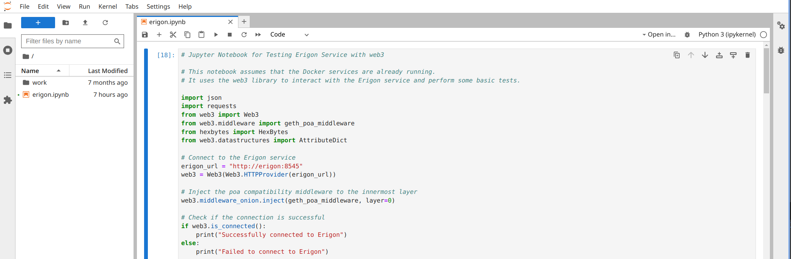

# JupyterHub with World ID Authentication

## Overview

This proof of concept (PoC) demonstrates an advanced data analytics system incorporating World ID authentication. It integrates several key technologies to provide a comprehensive data analysis solution for the Ethereum Blockchain.

## Key Components

### JupyterHub and JupyterLab

- **[JupyterHub](https://jupyterhub.readthedocs.io)**: A multi-user server that allows multiple users to access Jupyter notebooks concurrently.
- **[JupyterLab](https://jupyterlab.readthedocs.io/en/latest/)**: A versatile web-based interactive development environment for working with Jupyter notebooks.
- **BlockScience**: A specialized data analytics notebook tailored for Ethereum, derived from the [Jupyter Data Science Notebook](https://hub.docker.com/r/jupyter/datascience-notebook/).
- **[Traefik](https://traefik.io/traefik/)**: A modern, efficient HTTP reverse proxy and load balancer, crucial for managing web traffic to the JupyterHub server.

### Erigon

- **[Erigon](https://erigon.tech/)**: A high-performance Ethereum archive node that stores comprehensive blockchain data, enabling detailed analysis and historical querying.

### Monitoring and Observability

- **[Grafana](https://grafana.com/docs/grafana/latest/)**: An open-source platform for monitoring and observability, allowing the creation of dynamic dashboards to visualize metrics.
- **[Prometheus](https://prometheus.io/docs/introduction/overview/)**: An open-source systems monitoring and alerting toolkit that collects and stores metrics as time series data.
- **[Node Exporter](https://prometheus.io/docs/guides/node-exporter/)**: A Prometheus exporter that provides hardware and operating system metrics.
- **[cAdvisor](https://github.com/google/cadvisor)**: A tool that offers insights into the resource usage and performance characteristics of running containers, essential for containerized environments.

## Screenshots


*JupyterHub World ID authentication*


*World ID login interface*


*Available JupyterLab Kernels*


*Integration with Erigon in JupyterLab*


*Parsing Ethereum Blockchain data using web3*

## Getting Started

To begin, ensure you have Docker Compose installed. Verify that your hardware meets the [Erigon Hardware Requirements](https://erigon.gitbook.io/erigon/basic-usage/getting-started#hardware-requirements). Obtain your `OAUTH_CLIENT_ID` and `OAUTH_CLIENT_SECRET` from the [WorldCoin Developer Portal](https://developer.worldcoin.org) and set them in the `.env` file. For production setup, include `jupyter.$DOMAIN` and `grafana.$DOMAIN` in your DNS configuration and adjust `.env.prod` accordingly.

### Prerequisites

- **Docker**: [Install Docker](https://docs.docker.com/get-docker/)
- **Docker Compose**: [Install Docker Compose](https://docs.docker.com/compose/install/)
- **Make**: Ensure `make` is installed on your system. It simplifies the process of managing Docker services.

### Environment Variables

Create a `.env` file in your project root and populate it with the following variables for development:

```env
OAUTH_CLIENT_ID=your_oauth_client_id
OAUTH_CLIENT_SECRET=your_oauth_client_secret
OAUTH_CALLBACK_URL=http://localhost:8000/hub/oauth_callback
JUPITER_ADMIN='your_jupiter_admin_key' # Get this from https://simulator.worldcoin.org
JUPITER_LOGLEVEL='DEBUG'
JUPITER_SPAWNIMAGE='blockscience:latest'
GF_SECURITY_ADMIN_PASSWORD=your_grafana_password
```

For production, create a .env.prod file with these variables:

```env
OAUTH_CALLBACK_URL=https://jupyter.example.org/hub/oauth_callback
JUPITER_LOGLEVEL='INFO'
EMAIL=your_email@example.com
DOMAIN=example.org
```

### Configuration Details

- **OAuth Settings**: Ensure you have the correct OAuth client ID and secret from WorldCoin. These are crucial for the World ID authentication mechanism.
- **Admin Configuration**: Set the `JUPITER_ADMIN` with the appropriate admin key from the WorldCoin simulator.
- **Grafana Security**: Define a secure admin password for Grafana with `GF_SECURITY_ADMIN_PASSWORD`.
- **Domain Configuration**: For production, ensure your `DOMAIN` is correctly set to match your DNS entries.

## Usage

This PoC includes two Docker Compose configurations: one for local testing and another for production deployment with Traefik reverse proxy and SSL support.

### Service Commands

The Makefile provided facilitates the management of Docker Compose services. Below are the available commands and their usage.

#### Build Services

- `make build`: Build development service images.
- `make build-prod`: Build production service images.

#### Pull Services

- `make pull`: Pull the latest images for development services.
- `make pull-prod`: Pull the latest images for production services.

#### Start Services

- `make up`: Build, pull, and start the development environment.
- `make up-prod`: Build, pull, and start the production environment.

#### Stop Services

- `make stop`: Stop running development services.
- `make stop-prod`: Stop running production services.

#### Bring Down Services

- `make down`: Bring down and remove the development service containers.
- `make down-prod`: Bring down and remove the production service containers.

#### Destroy Services

- `make destroy`: Stop and remove development services, including volumes.
- `make destroy-prod`: Stop and remove production services, including volumes.

#### View Logs

- `make logs`: View logs for the development environment.
- `make logs-prod`: View logs for the production environment.

#### Prune Docker Containers

- `make prune`: Remove all stopped containers and free up system resources.

### Using Profiles

The `PROFILES` environment variable allows you to specify which profiles to use when running commands. By default, the following profiles are enabled:

- `jupyterhub`
- `erigon`
- `monitoring`

To start only certain services, set the `PROFILES` variable accordingly. For example:

```sh
PROFILES="jupyterhub erigon" make up
```

### Testing and Validation


Ensure that all components are running correctly by accessing the following URLs in your browser:

- JupyterHub: `http://localhost:8000`
- Grafana: `http://localhost:3000`

In production, replace `localhost` with jupyter.$DOMAIN and grafana.$DOMAIN


